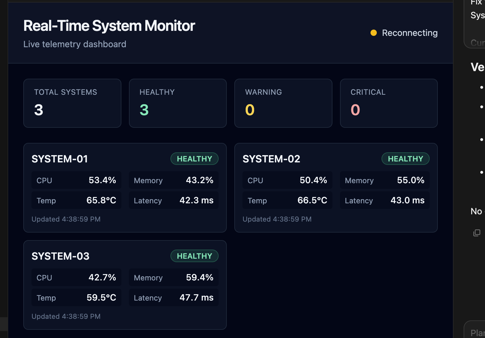

# Real-Time System Monitor

A full-stack dashboard that monitors simulated system telemetry in real time. I built this project to learn more about WebSockets, FastAPI, and real-time communication between a backend and frontend.

## Features

- Simulates CPU, memory, temperature, and latency for three systems
- Streams live telemetry to the dashboard using WebSockets
- Classifies systems as Healthy, Warning, or Critical
- Generates alerts when a metric changes health status
- Stores telemetry and alerts in SQLite
- Displays live temperature and latency charts

## Tech Stack

**Frontend:** React, TypeScript, Tailwind CSS, Recharts  
**Backend:** Python, FastAPI, WebSockets  
**Database:** SQLite

## How It Works

The backend generates telemetry for three simulated systems about once per second. Each reading is checked against warning and critical thresholds.

REST endpoints provide the initial system state and historical data. A WebSocket connection handles live updates so the dashboard does not need to continuously poll the backend.

Telemetry and alerts are also saved to SQLite so historical data remains available after restarting the server.

## Screenshots

### Dashboard



### Live Telemetry


### Alerts


## Running Locally

### Backend

```bash
cd backend
python3 -m venv .venv
source .venv/bin/activate
pip install -r requirements.txt
uvicorn app.main:app --reload --port 8000
