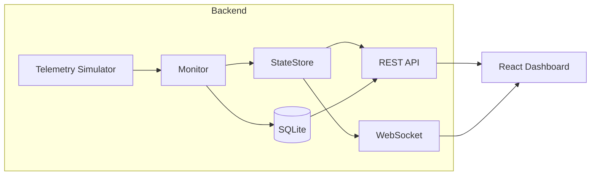

# Real-Time System Monitor

A full-stack portfolio project that simulates infrastructure telemetry, evaluates system health against thresholds, and streams live updates to a React dashboard.

## Summary

Three simulated systems (`SYSTEM-01`, `SYSTEM-02`, `SYSTEM-03`) generate CPU, memory, temperature, and latency metrics roughly once per second. A FastAPI backend evaluates each reading, detects threshold crossings, persists history to SQLite, and pushes live updates over WebSockets. A React dashboard shows current status, charts, and recent alerts.

## Why I Built It

I built this project to practice designing a small but realistic monitoring pipeline end to end: synthetic data generation, health evaluation, API design, real-time delivery, frontend state management, and persistence. It demonstrates skills I would use on operational tooling teams without pretending to be a production-grade observability platform.

## Key Features

- Simulated telemetry for three systems with gradual drift and temporary degradation/recovery events
- Threshold-based monitoring with `HEALTHY`, `WARNING`, and `CRITICAL` status
- State-transition alerts (no repeated alert spam while a metric stays hot)
- REST API for current state, historical telemetry, and alert history
- WebSocket streaming for live dashboard updates
- React dashboard with system cards, summary counts, Recharts visualizations, and reconnect handling
- SQLite persistence across backend restarts

## Tech Stack

| Layer | Technologies |
|---|---|
| Backend | Python, FastAPI, WebSockets, SQLite (`sqlite3`) |
| Frontend | React, Vite, TypeScript, Tailwind CSS, Recharts |
| Tooling | Uvicorn, npm |

## Architecture Overview



**Live path:** Simulator → Monitor → StateStore → REST / WebSocket → Dashboard

**Historical path:** Telemetry pipeline → SQLite → REST (`/api/telemetry`, `/api/alerts`)

## Data Flow

1. **Generate** — The simulator produces one reading per system per second with gradual metric changes.
2. **Evaluate** — The monitor compares each reading to centralized thresholds and derives per-metric and overall status.
3. **Alert** — The alert detector emits an event only when a metric crosses a health boundary.
4. **Store (memory)** — `StateStore` keeps the latest values and a bounded in-memory window for fast live reads.
5. **Persist (disk)** — Each reading and new alert is appended to SQLite.
6. **Serve** — REST returns current or historical data; WebSocket pushes incremental updates to connected clients.
7. **Display** — The dashboard bootstraps from REST, then updates live from WebSocket messages.

## Why REST and WebSockets?

**REST** is used for:

- Initial dashboard load (`/api/systems`, `/api/alerts`)
- Historical telemetry and alert queries backed by SQLite
- Simple request/response access for debugging and tooling

**WebSockets** are used for:

- Live push updates as each new reading is generated
- Low-latency dashboard refreshes without polling every second

This split avoids repeatedly calling `GET /api/systems` for rapidly changing telemetry while still keeping historical queries straightforward.

## Monitoring and Alert Logic

Monitoring evaluates **metric values only**. It is separate from the simulator's internal `healthy` / `degrading` / `recovering` phases, which control how synthetic data is generated.

| Metric | Warning | Critical |
|---|---|---|
| Temperature | ≥ 75°C | ≥ 90°C |
| CPU | ≥ 75% | ≥ 90% |
| Memory | ≥ 80% | ≥ 92% |
| Latency | ≥ 100 ms | ≥ 200 ms |

Overall system status equals the **most severe** metric status. Alerts fire on transitions such as `HEALTHY → WARNING` or `WARNING → CRITICAL`, not on every tick while a threshold remains breached.

## SQLite Persistence

- Database file: `backend/data/telemetry.db` (gitignored)
- Tables: `telemetry`, `alerts`
- **In memory:** latest system state for fast live endpoints and WebSocket broadcasting
- **On disk:** append-only history for `/api/telemetry/{system_id}` and `/api/alerts`

After a backend restart, historical data remains in SQLite, while live current state is rebuilt from new simulator readings.

## Project Structure

```
real-time-system-monitor/
├── backend/
│   ├── app/
│   │   ├── api/          # REST and WebSocket routes
│   │   ├── db/           # SQLite schema and repository
│   │   ├── monitoring/   # Threshold evaluation and alerts
│   │   ├── services/     # Background telemetry loop
│   │   ├── state/        # In-memory StateStore
│   │   └── simulator.py  # Telemetry simulation
│   ├── scripts/          # WebSocket test client
│   └── requirements.txt
└── frontend/
    └── src/
        ├── components/   # Dashboard UI
        ├── hooks/        # WebSocket hook
        └── types/        # REST/WebSocket types
```

## How to Run Locally

### Prerequisites

- Python 3.12+
- Node.js 18+

### Backend

```bash
cd backend
python3 -m venv .venv
source .venv/bin/activate          # Windows: .venv\Scripts\activate
pip install -r requirements.txt
uvicorn app.main:app --reload --port 8000
```

- API docs: http://localhost:8000/docs
- Health check: http://localhost:8000/api/health

### Frontend

```bash
cd frontend
npm install
npm run dev
```

- Dashboard: http://localhost:5173

### Optional: WebSocket test client

```bash
cd backend
source .venv/bin/activate
python scripts/ws_test_client.py --count 10
```

## API Endpoints

| Method | Path | Description |
|---|---|---|
| `GET` | `/api/health` | Service health check |
| `GET` | `/api/systems` | Latest state for all systems |
| `GET` | `/api/systems/{system_id}` | Latest state for one system (404 if unknown) |
| `GET` | `/api/telemetry/{system_id}?limit=100` | Historical telemetry from SQLite (max `limit=1000`) |
| `GET` | `/api/alerts?limit=100` | Persisted alerts (optional `system_id`, `severity` filters) |
| `WS` | `/ws/telemetry` | Live telemetry JSON stream |

## Screenshots

<!-- Add screenshots here after capturing the running dashboard -->
| Dashboard overview | Live charts and alerts |
|---|---|
| _Screenshot placeholder_ | _Screenshot placeholder_ |

Suggested captures:

1. Summary bar + three system cards with live status
2. Temperature/latency charts with threshold reference lines
3. Recent alerts panel after a warning/critical transition

## Future Improvements

- Serve threshold configuration from the backend instead of duplicating values in the frontend
- Add authentication and role-based access for admin views
- Batch or async SQLite writes for higher throughput
- Data retention policy and archival
- Deployment with Docker and environment-based configuration
- Integration tests across REST, WebSocket, and dashboard flows

## What I Learned

- How to separate **data generation**, **evaluation**, **live state**, and **persistence** into clear layers
- Why WebSockets complement REST instead of replacing it in monitoring UIs
- How to prevent alert noise with **state-transition detection** rather than threshold polling
- How to structure a FastAPI app with a background asyncio task and lifespan-managed startup/shutdown
- How to bootstrap a React dashboard from REST and keep it live with a reconnecting WebSocket hook
- Tradeoffs of synchronous SQLite writes in a demo vs. what would change at higher scale

---

Built as a learning and portfolio project. It is intentionally scoped for clarity, not production operations.
